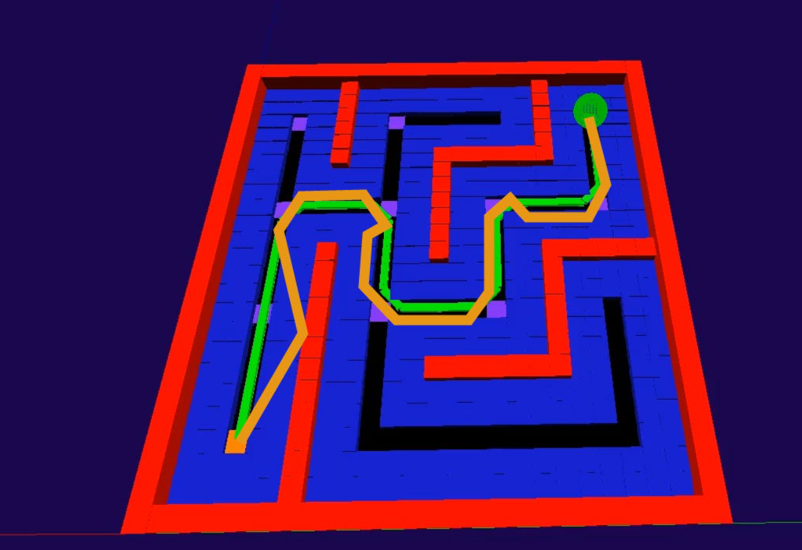

# Pathfinding-Simulator

## About the project
This project was done during High Schools. We were three students: Baptiste Tajan, Chauchat Eymeric and Paul Capgras.
The main goal was to design a proof of concept of a warehouse robot capable to move freely in an environment autonomously. 

We started from the robot in the picture bellow: We added communications modules, camera and an alimentation.

## About the repo

I worked on a pathfinding simulator to be abble to code and test different type of algorithms. This simulator also allow us to interract directly with the robot. That was is this repo is about.

Overall, the simulator is 3D, includes a maze generator and uses wxpython and OpenGL. Thanks to this simulator, I could:
- generate maps representing my warehouse, 
- create or edit a map by hand
- place landmarks on my model which would echo lines on the real warehouse floor, and which the robot could use to locate itself.
- define a starting point and an end point
- test different trajectory search algorithms on this simulator. (As the simulator was dynamic, we could see live images of the zones explored by the trajectory algorithm).

In red, walls. In blue, safety margins to prevent the robot from getting too close to the walls. The robot is the green ball, the green square is the starting point, the orange square the end point. The green lines represent the trajectory determined by the algorithm. The purple squares correspond to lines on the floor actually positioned in the real warehouse. The orange line corresponds to the robot's actual path.

## Link with the robot

The robot locates itself in space by integrating its position from its small inertial unit. Given our budget and the effects of wheel slippage, we were not precise. To counter this problem, we performed a second localization using markers on the ground detected by the robot's front camera. These markers were simple little lines on the ground and on the robot model, allowing the robot to reposition itself.

## Video of the software + the robot in action
https://youtu.be/d7s9VPNReBY
