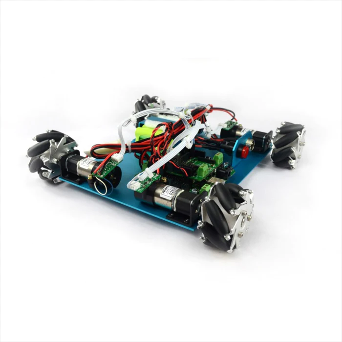
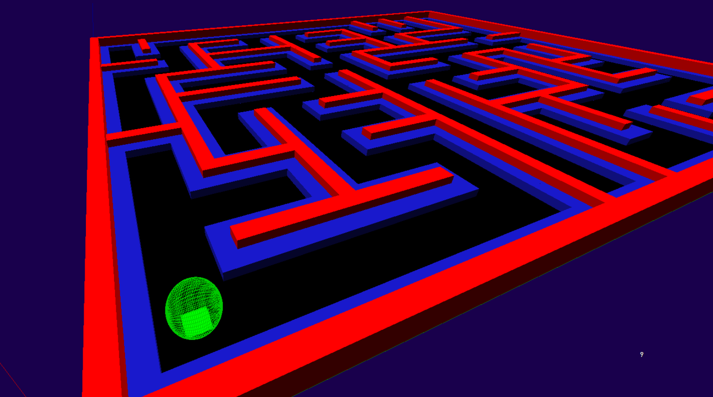

# Pathfinding-Simulator-For-A-Warehouse-Robot

## The warehouse robot
The robot was part of a project done during high school. The main goal was to design a proof of concept of a warehouse robot capable to move freely in an environment autonomously. 

We started from the robot in the picture bellow:

It contained:
- 4 DC motors with a speed sensor on each wheel
- a command card with a microcontroller inside.

We added:
- an alimentation circuit
- a camera
- a camera stream relayer
- one arduino nano with a RF antenna and receiver

On the computer was connected:
- a camera stream receiver
- one arduino nano with a RF antenna and receiver

The robot located itself by integrating the rotation speed of the wheels coming from tachometer sensors. But to fix the integration error, the robot used the camera to detect lines on the ground and used theses fixed and already known lines to replace itself in the warehouse.

The following software was used to pilot autonomously the robot, to test pathfinding algorithms and also to create the map of the warehouse (with the localization of the lines). 

## Video of the software + the robot in action
https://youtu.be/d7s9VPNReBY

## The repo : a pathfinding simulator
This repo correspond the software which was used to pilot autnomously the robot, test pathfinding algorithms and create maps for the warehouses.

Overall, the simulator is 3D, includes a maze generator and uses wxpython and OpenGL. Thanks to this simulator, you can:
- generate maps representing my warehouse, 
- create or edit a map by hand
- place landmarks on my model which would echo lines on the real warehouse floor, and which the robot could use to locate itself.
- define a starting point and an end point
- test different trajectory search algorithms on this simulator. (As the simulator is dynamic, you could see live images of the zones explored by the trajectory algorithm).

In red, walls. In blue, safety margins to prevent the robot from getting too close to the walls. The robot is the green ball, the green square is the starting point, the orange square the end point. The green lines represent the trajectory determined by the algorithm. The purple squares correspond to lines on the floor actually positioned in the real warehouse. The orange line corresponds to the robot's actual path.

